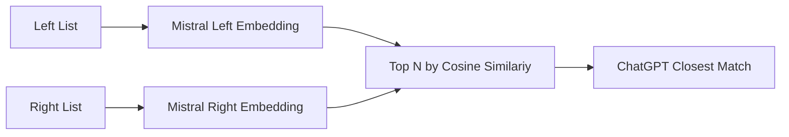

# vinge

Link financial datasets using noisy company names.

# HOWTO

Linux only.

```bash
# gpu support on debian
bash vinge/gpu.sh

# install
git clone https://github.com/mjudell/vinge.git
pip install ./vinge

# configure (pull language model binaries, configure api keys, etc)
vinge configure

# example
vinge link \
    --candidate-links 25 \
    --final-links 1 \
    --left vinge/examples/ishares.csv \
    --right vinge/examples/13f.csv \
    --output ishares_13f.csv
```

# Architecture

For each entity in the left list find the top N in the right list using Mistral embeddings and cosine similarity. Then use ChatGPT to select the best match.



