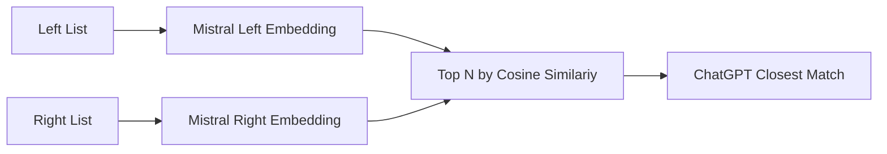

# vinge

Link financial datasets using noisy company names.

# HOWTO

Linux only. Do not parallelize with `xargs`.

```bash
# (optional) enable gpu support on debian
bash vinge/gpu.sh

# install
git clone https://github.com/mjudell/vinge.git
pip install ./vinge

# configure (pull language model binaries, configure api keys, etc)
vinge configure

# create batch query for openai
vinge init \
    --job example \
    --ngram-candidates 5 \
    --mistral-candidates 5 \
    --left vinge/examples/ishares.csv \
    --right vinge/examples/13f.csv \
    --output-basedir vinge/examples

# submit batch query
vinge submit --job example

# check status of submitted batch queries
vinge status

# fetch a complete query
vinge fetch --job example
```

# Architecture

For each entity in the left list find the top N in the right list using Mistral embeddings and cosine similarity. Then use ChatGPT to select the best match. I also use character n-gram embeddings in case the Mistral embeddings don't turn up good candidates.


